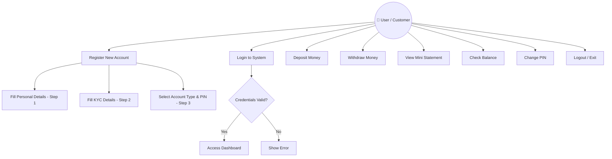
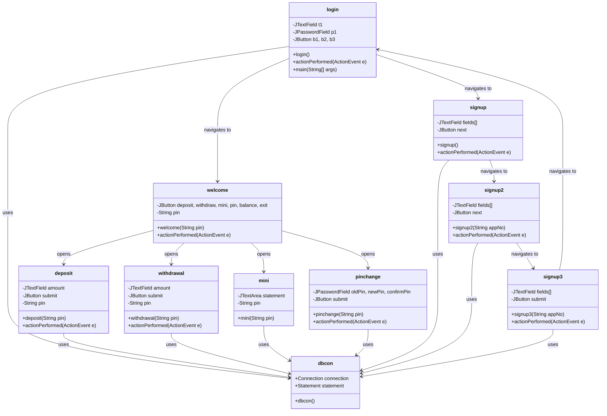
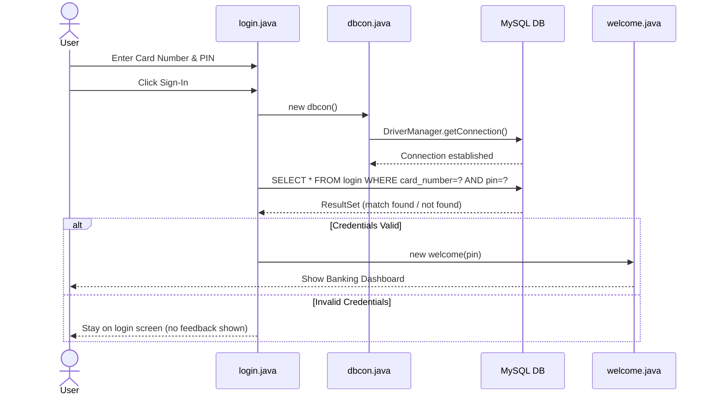
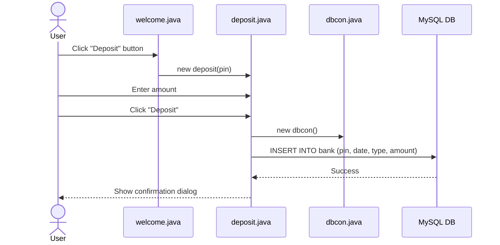
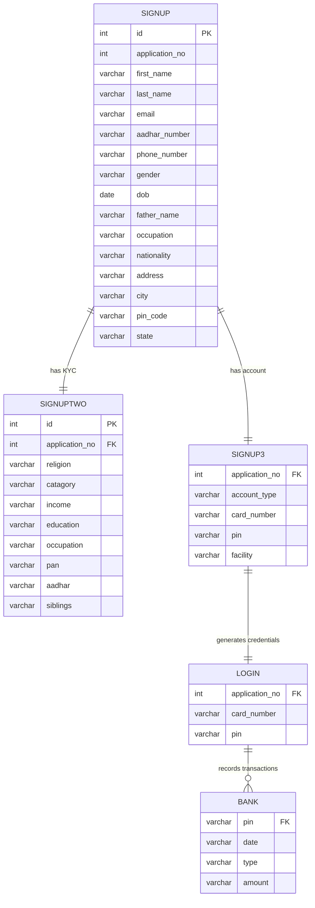
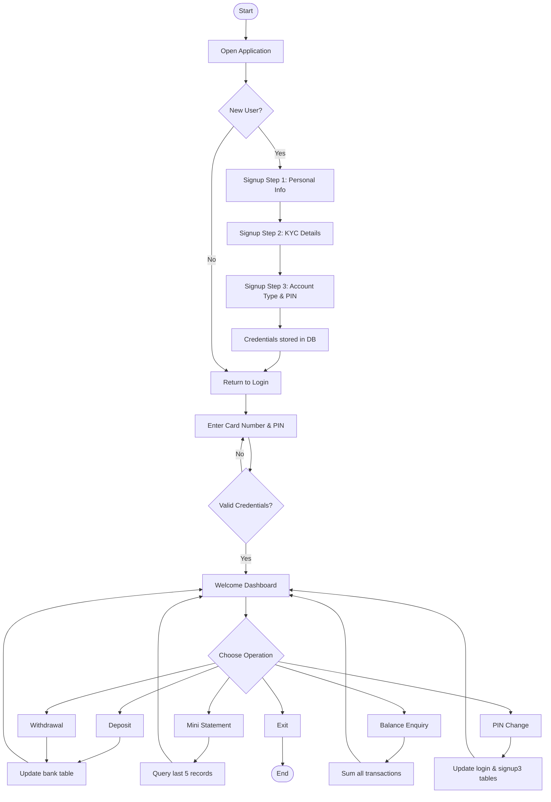

# 🏦 Bank Management System — System Design & Architecture

---

## 1. System Architecture

The application follows a **3-Tier Client-Server Architecture**:

```
┌─────────────────────────────────────────────────────────┐
│                    PRESENTATION LAYER                    │
│          Java Swing / AWT GUI Components                 │
│  login │ signup │ welcome │ deposit │ withdrawal │ mini  │
└───────────────────────┬─────────────────────────────────┘
                        │ Java method calls
┌───────────────────────▼─────────────────────────────────┐
│                    BUSINESS LOGIC LAYER                  │
│         Java Classes (ActionListener, Event Handling)    │
│     Input Validation │ Transaction Logic │ Navigation    │
└───────────────────────┬─────────────────────────────────┘
                        │ JDBC (SQL Queries)
┌───────────────────────▼─────────────────────────────────┐
│                      DATA LAYER                          │
│              MySQL Database (banksystem)                 │
│   signup │ signuptwo │ signup3 │ login │ bank (tables)   │
└─────────────────────────────────────────────────────────┘
```

---

## 2. Use Case Diagram



---

## 3. Class Diagram



---

## 4. Sequence Diagram — Login Flow



---

## 5. Sequence Diagram — Deposit Flow



---

## 6. ER Diagram (Entity-Relationship)



---

## 7. Process / Workflow Diagram



---

## 8. Database Schema

| Table | Purpose |
|-------|---------|
| `signup` | Stores personal information from signup step 1 |
| `signuptwo` | Stores KYC/additional info from signup step 2 |
| `signup3` | Stores account type, card number, PIN, and facilities |
| `login` | Stores credentials used for authentication |
| `bank` | Stores all transaction records (deposit/withdrawal) |

### Key Relationships
- `application_no` links `signup` → `signuptwo` → `signup3` → `login`
- `pin` links `login` → `bank` (transaction history)
